<p align="center">
  
</p>

# Coherence Engineering

Coherence Engineering is a software engineering practice where quality is defined as the degree of coherence between all artifacts in a system.

Artifacts include production code, tests, specifications, observability data, roadmaps, and any other documented context that describes what a system is, does, or should do. There is no single source of truth. Every artifact is a partial view of reality, and quality emerges from how well they tell the same story together.

## Why This Exists

Traditional quality practices — testing, code review, documentation — treat artifacts in isolation. Tests pass but specs drift. Code ships but observability is blind. Documentation ages. The result is entropy: a system that works technically but is incoherent as a whole.

This happens because each practice has its own feedback loop. Tests validate code against assertions. Reviews validate code against conventions. Documentation validates understanding against memory. None of these loops check whether the artifacts agree with each other.

Coherence Engineering addresses this by making the relationships between artifacts the primary measure of quality, and by continuously maintaining those relationships through a detect-and-correct loop.

## Prerequisites: AI Readiness

Before coherence can be measured, artifacts must exist and be accessible. This means:

- **Production code** in version control.
- **Tests** with clear intent — not just passing, but expressing what the system should do and why.
- **Specifications** that capture domain and technical decisions, whether formal documents, ADRs, or structured notes.
- **Observability data** queryable as a data source — logs, metrics, traces, accessible programmatically.
- **Broader context** like related repositories, architecture decisions, or documentation dumps — stored accessibly, ideally in the file system or version control.

Without these, there is nothing to measure coherence against. The first step is often not measurement but preparation: making implicit knowledge explicit and machine-readable.

## The Coherence Engineering Loop

The practice is a continuous loop:

```
  ┌─────────────────────────────────────────────────────┐
  │                                                     │
  │   Measure ──► Detect ──► Resolve ──► Implement ─┐   │
  │      ▲                                          │   │
  │      └──────────────────────────────────────────┘   │
  │                                                     │
  └─────────────────────────────────────────────────────┘
```

### 1. Measure coherence

For each pair of artifacts, assess how well they align. This is qualitative, not just quantitative. A failing test is a coherence measurement. A spec that contradicts production behavior is a coherence measurement. An observability gap — where production runs code paths that no metric or trace covers — is a coherence measurement.

### 2. Detect decoherence

Analyse measurements to find which artifact pairs are misaligned. Think of artifacts as a multidimensional cloud of claims about what the system is and does. An outlier is an artifact that is incoherent with the rest — it tells a different story than the majority.

### 3. Resolve decoherence

Surface the decoherence with context and alternatives. A human or agent decides the direction of resolution. This decision is always auditable.

There are two paths, described in detail below.

### 4. Implement

Apply the chosen resolution: fix the test, update the spec, refactor the code, realign the roadmap. This is ordinary engineering work, but directed by coherence rather than by isolated bug reports or feature requests.

### 5. Repeat

Coherence converges over time. Each pass through the loop reduces the distance between what the system is, what it claims to be, and what it should become.

## The Two Resolution Paths

This is the heart of the practice. When decoherence is detected, the question is never just "what is broken?" It is "which artifact is right?"

**Path A: The outlier moves toward the cloud.** Most of the time, this is the answer. A test is wrong. A spec is outdated. Documentation drifted. The fix is straightforward: update the outlier to match the coherent majority. The system's story was correct; one artifact fell behind.

**Path B: The cloud moves toward the outlier.** Sometimes the outlier is the artifact that got it right — and everything else is behind. This reveals something important: a vision that has shifted, an assumption that was never valid, a market reality that wasn't captured anywhere. In this case, the resolution is to update the rest of the system to match the outlier. The outlier was ahead; the story needs to change.

Human or agent judgment determines which path to take. The practice does not automate this decision. It surfaces the information needed to make it well.

## Coherence as Quality

Coherence is not a number. It is a qualitative assessment of how well artifacts tell the same story. It can be described in text, reasoned about by LLMs, and acted upon by agents or humans.

This makes it compatible with traditional software systems where code, tests, and specs are the primary artifacts. It is equally compatible with AI-native systems where code may not even exist — where prompts, model outputs, training data, evaluation sets, and feedback loops are the artifacts. The practice is the same: measure alignment, detect divergence, resolve it.

## Tooling

Start without a dashboard.

Use an LLM to assess coherence between artifact pairs. Have it output markdown reports with decoherence findings, supporting evidence, and proposed resolutions. Surface these for human review. A simple conversational interface is enough to prove the loop works.

The pattern:

1. Feed two artifacts to an LLM with the prompt: "How well do these tell the same story? Where do they diverge?"
2. Collect the assessment as structured output.
3. Present divergences ranked by severity for human review.
4. Record the resolution decision and rationale.

Dashboards and automation come later, built on the same underlying agent logic. The goal is not tooling — it is the practice. Tooling serves the loop; it does not replace it.

## Relationship to Existing Practices

Coherence Engineering is not a replacement for test-driven development, specification-driven development, or observability practices. It is a layer above them.

TDD ensures code satisfies assertions. Specification-driven development ensures code satisfies requirements. Observability ensures production behavior is visible. Each practice works within its own scope.

Coherence Engineering asks whether all of these are coherent with each other — not just whether each one works in isolation. It is the practice of maintaining the relationships between practices.

## Getting Started

1. **Identify your artifacts.** List everything that makes a claim about your system: code, tests, specs, ADRs, runbooks, dashboards, roadmaps. Be honest about what exists and what is missing.

2. **Pick one pair.** Choose two artifacts and assess their coherence. Do the tests reflect what the spec says? Does the observability setup cover what the code actually does? Does the roadmap align with the architecture decisions?

3. **Find the decoherence.** There will be some. There always is.

4. **Resolve it.** Decide which artifact is right. Update the other. Record why.

5. **Repeat.**

---

Coherence Engineering is young. The ideas here are stable enough to practice, open enough to evolve. If you build systems and feel the friction of artifacts that don't agree with each other, this is a name for what you're already noticing — and a loop for what to do about it.
